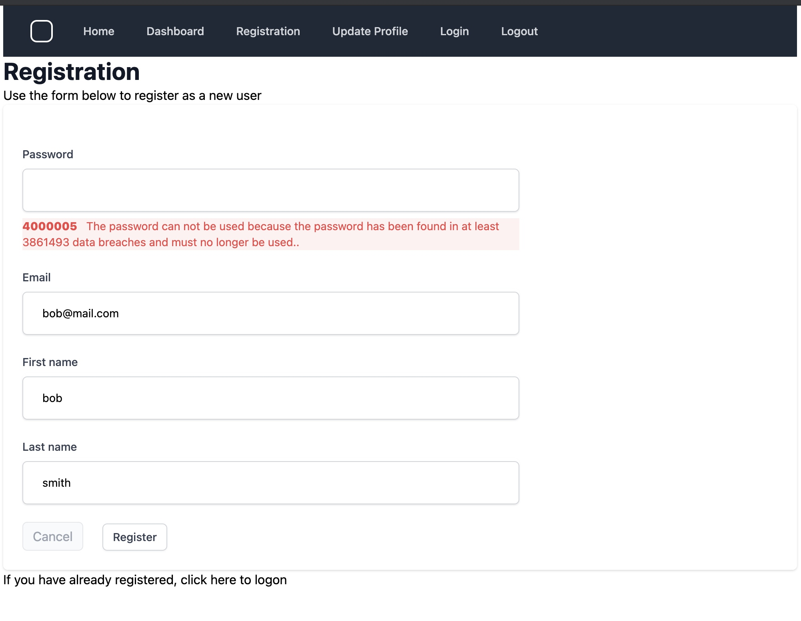

# Abletech Blog Post - Kratos self service in Go

## Introduction

Building applications is hard, and developers need to maximise productivity, so they can focus their efforts on solving business problems.  One way of achieving this is to use services provided by third party providers.  This allow developers to offload essential application responsibilities; for example by using database services from AWS.  This trend has been with us for many years, and has seen the rise in many services such as compute services, file storage, and hosting.  The same shift has been seen with application level services, whereby it has become more and more attractive over time to integrate services together to build business applications.

A common requirement for modern web based applications, is the provision for users to register, login, logout and manage their own accounts.  This is where [Krytos](https://www.ory.sh/kratos) comes in. Kratos is an open source project that help takes the burden of providing these services in your own applications.

When your application integrates with Krytos then you gain the benefits of:

- Providing the benefits of keeping up with security best practices.
- BYO user interface. Kratios allows you to define the look'n'feel of the UI. The user interface is implemented in your application, giving you full control.
- BYO data model.  The identity data model that Kratos uses is provided by your application.
- Long term support. Kratos project is supported by some big players in the open source space such as ThoughtWorks and the Raspberry Pi project.

This blog post explains how to write an application `kratos-selfservice-ui-go`, that integrates with Kratos, written in  [Go](https://golang.org/). Source code for `kratos-selfservice-ui-go` is available on [github](https://github.com/davidoram/kratos-selfservice-ui-go).

The structure of the application is relatively straightforward, and based on the [Kratos self service example application written in Node](https://github.com/ory/kratos-selfservice-ui-node). It provides the following self service UI pages:

- Registration
- Login
- Logout
- User settings
    - Update profile
    - Change password
    - Password reset

Once a user is logged in, they get access to the following additional page:

- Dashboard

## Architecture

For convenience, a demonstration system, can be run using Docker compose.

**Fig 1: Architecture overview**


The components have these functions:

- [`traefik`](https://traefik.io/traefik/) reverse proxy presents the Kratos and self service app together as a *single unified website* running under one host. This is improtant because Kratos and the self-service app share state through cookies.
- `kratos-migrate` service (not shown on the diagram) creates a [sqlite](https://www.sqlite.org/) database for Krytos, and runs database migrations.
- `kratos` is the Kryrtos server
- [`mailhog`](https://github.com/mailhog/MailHog) is a self contained email server which presents a simple web UI, as well as an API which is usefull for integration testing.
- `kratos-selfservice-ui-go` is our go sample application. It intgerates with Kratos, presenting all the UI pages needed by Kratos, as well as providing a Dashboard page that can only be accessed when the user is logged in.


## Running the sample

To run the sample you will need [`Docker`](https://www.docker.com/), installed, then run:

```
make quickstart
```

After a few seconds, you should be able to navigate to the website at [http://localhost/](http://localhost/) and you should see a page like this:


## Registration

Clicking on the [Registration](http://localhost/auth/registration) button starts the registration flow.

The registration web handler code from `handlers/registration.go`, is as follows:

```golang
// Registration directs the user to a page where they can sign-up or
// register to use the site
func (rp RegistrationParams) Registration(w http.ResponseWriter, r *http.Request) {

	// Start the login flow with Kratos if required
	flow := r.URL.Query().Get("flow")
	if flow == "" {
		log.Printf("No flow ID found in URL, initializing login flow, redirect to %s", rp.FlowRedirectURL)
		http.Redirect(w, r, rp.FlowRedirectURL, http.StatusMovedPermanently)
		return
	}

	// Call Kratos to retrieve the login form
	params := public.NewGetSelfServiceRegistrationFlowParams()
	params.SetID(flow)
	log.Print("Calling Kratos API to get self service registration")
	res, err := api_client.PublicClient().Public.GetSelfServiceRegistrationFlow(params)
	if err != nil {
		log.Printf("Error getting self service registration flow %v, redirecting to /", err)
		http.Redirect(w, r, "/", http.StatusMovedPermanently)
		return
	}
	dataMap := map[string]interface{}{
		"config":      res.GetPayload().Methods["password"].Config,
		"flow":        flow,
		"fs":          rp.FS,
		"pageHeading": "Registration",
	}

	if err = GetTemplate(registrationPage).Render("layout", w, r, dataMap); err != nil {
		ErrorHandler(w, r, err)
	}
}
```

The handler is typical of the integration points that your app will have Kratos. First it checks for the `flow` URL parameter, and if not present redirects the browser to the Kratos endpoint `http://127.0.0.1/self-service/registration/browser` which starts registration inside Kratos, and then redirects straight back to this handler in your app.

The next step is to call the `NewGetSelfServiceRegistrationFlowParams` Kratos API, passing the `flow` parameter, which will return a data structure representing the form structure that Kratos is expecting.

The data structure is as follows:

```json
{
  "action": "http://127.0.0.1/self-service/registration/methods/password?flow=373bdce4-7e06-4fad-a7a1-f5366f3bc509",
  "method": "POST",
  "fields": [
    {
      "name": "csrf_token",
      "type": "hidden",
      "required": true,
      "value": "Xut/HbFdJTR2rNXsnWpznRVMezSyS7b+NUibcwIRR03+06Ag+yui/hgGaxdRM6XocWFBT7PRl4NZpdXR0pw7LA=="
    },
    {
      "name": "password",
      "type": "password",
      "required": true
    },
    {
      "name": "traits.email",
      "type": "email"
    },
    ...
  ]
}
```

It may not be immediately obvious, but this data structure has been designed, so that it is deliberately easy to convert into an HTML form.

You simply contruct an HTML `<form>` element with the `action` and `method` attributes, and then iterate over the `fields`, turning each one into an `<input>` element with the attributes and `value` provided.  The only decision you need to make are the order that the fields are displayed on the form, and any styling you want to apply.

Here is the resulting form:


I've deliberately entered a weak password as part of my registration, and when I sumbitted the form, Kratos responds with the same data structure as before, but containing validation errors, so we can present that to the user, and allow them to respond.

Errors are [coded](https://www.ory.sh/kratos/docs/concepts/ui-user-interface#messages) for easy translation, in this case `4000005` along with response text that described the error condition:



Correcting that error and resubmitting the form, leads to a sucesful registration:


Kratos has some flexibility around what happens next, in my case I have configured Kratos to send a registration email, asking the user to confirm their email address, but this is not required in order to login.  By opening [mailhog](http://localhost:8025/) we can view the email:


After registration, the user is automatically logged in to the site.

Clicking on the [Dashboard](http://127.0.0.1/dashboard) link passes the request through the [KratoAuthMiddleware](middleware/kratos_auth.go).  The purpose of this middleware is to restrict access to pages that require the user to be logged in.

The `KratoAuthMiddleware` calls the Kratos [`WhoAmI`](https://www.ory.sh/kratos/docs/reference/api#check-who-the-current-http-session-belongs-to) endpoint with  the `csrf_token` and `ory_kratos_session` cookies. `WhoAmiI` returns a `Session` object which contains a wealth of information about the logged in user.

Calling the `WhoAmiI` API **every time** a protected page is accessed, is the [recommended approach](https://github.com/ory/kratos/discussions/1207), to verifying that the session is still active. This means that Kratos has responsibility for managing the session lifecycle, see [configuration](https://www.ory.sh/kratos/docs/reference/configuration) (refer to `session.lifespan`). On my laptop, running everything locally this call only takes 3-8 ms, but it will be worth checking performance in your scenario, with a production sized database of users.


The other functions of the application are pretty self explanatory:

- [Login](http://127.0.0.1/auth/login), and [Logout](http://127.0.0.1/auth/logout) provide the obvious functions.
- [Update Profile](http://127.0.0.1/auth/settings) is slightly more interesting, in that it presents a page with two forms, one to update your password, and the other to update name and email address.
- There is also an [Account recovery](http://127.0.0.1/auth/recovery) page linked to from the login page, for the situation when the user forgets their password.

## Conclusions

Once you understand the general flow of the Kratos interactions, the integration work is relatively straightforward, and Kratos provides a lot of functionaly, and flexibility which makes it a very attractive option for solving application authentication.

Before starting its worth taking some time to look at all the [configuaration options](https://www.ory.sh/kratos/docs/reference/configuration) that Kratos provides. This will allow you to evaluate how you might migrate existing user data from another system into Kratos, or how to implement a system for your back office that would allow a helpdesk user to find users in the system and help them with login issues.

There is *much* more to Kratos that covered in the blog post, I encourage you to look through the [Kratos docs](https://www.ory.sh/kratos/docs/) if you want to learn more.

## Implementation notes

The application experiments with a few interesting features that you might use in a production quality Go app:

- The app is written in [Go](https://golang.org/) version 1.16
    - All html templates are [embedded](https://golang.org/pkg/embed/) in the binary. This means the entire app is contained in a single executable.
    - The [Gorilla toolkit](github.com/gorilla) provides the URL multiplexor, useful middleware for logging and error handling, and session handling modules.
    - The [HashFS](https://github.com/benbjohnson/hashfs) library allows static assets (CSS, JS) to be correctly cached by appending SHA256 hashes to filenames.
    - Kratos supply a [Go client api](github.com/ory/kratos-client-go), which makes development easier.
- I experimented with [Tailwind CSS](https://tailwindcss.com/). I don't normally get much chance to play with the look'n'feel of the app, so this was a fun part of the project for me.
  - Note that I haven't applied any steps to minimize the CSS, but I would expect that to be relatively straightforward.
- There is a small amount of Javascript (opening and closing the menu), for which I used [Stimulus](https://stimulus.hotwire.dev), as a simpler alternative to using something like React.
- The Docker file uses a multi-stage build, to compile the app, and then produce a smaller Docker image (approx 18 Mb).
- A comprehensive test suite for the website is written using [Cypress](https://www.cypress.io/). I focussed on integration tests, rather than a lot of unit tests, because thats what this project was all about. The tests cover most if not all of the integration points.
    - The application uses `data-cy` attributes as test hooks, as recommended in the [cypress best practices](https://docs.cypress.io/guides/references/best-practices#Selecting-Elements).
    - Tests use the `mailhog` API to check programatically if emails are sent correctly. See [recovery.js](cypress-tests/cypress/integration/recovery.js) for an example of this.
    - Tests run in Docker, so no need to install cypress.
    - Its easy to run tests against newer (or older) browser releases, by altering the base image in the [Dockerfile](cypress-tests/Dockerfile)
    - Easy to run the tests in headless or interactive mode. The interactive tests use a browsers bundled with the [cypress-included](https://github.com/cypress-io/cypress-docker-images#cypress-docker-images-) images, which means that it does not interfere or clash with the browser running on my laptop. See the `make cypress` target to see how that runs in conjunction with an [X](https://en.wikipedia.org/wiki/X_Window_System) server running on my laptop.
    - On the downside, an extra step is required to include the custom node modules required by the tests in the docker image - see `make cypress-docker` and [Dockerfile](cypress-tests/Dockerfile) for details.
    - Here is a video of the running the tests in headless mode:

[](https://asciinema.org/a/NikVhrzOo326n2e6H3EfpCzLv)

