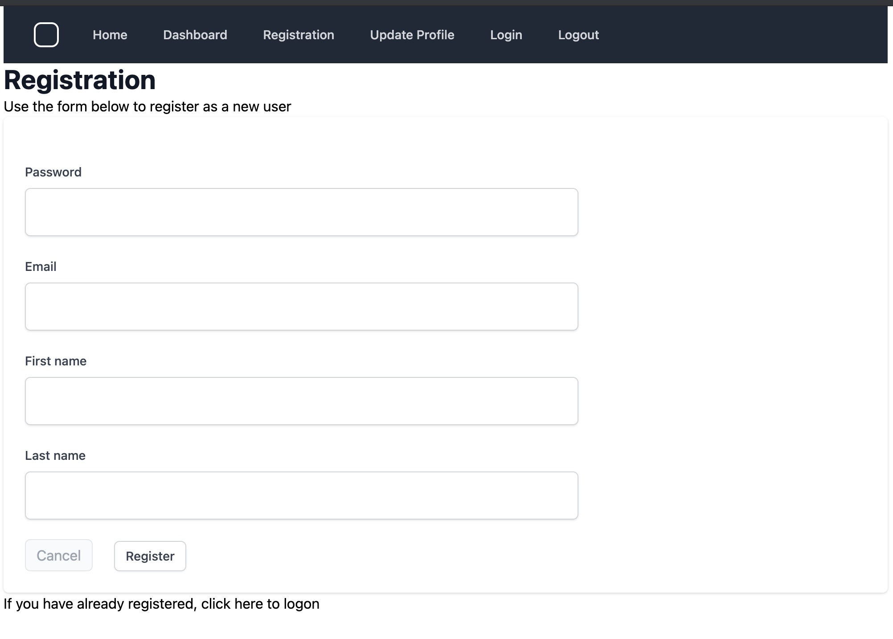

# Abletech Blog Post - Kratos self service in Go

## Introduction

Building applications is hard, and developers need to maximise productivity, so they can focus their efforts on solving business problems.  One way of achieving this is to use services provided by third party providers.  This allow developers to offload essential application responsibilities; for example by using database services from AWS.  This trend has been with us for many years, and has seen the rise in many services such as compute services, file storage, and hosting.  The same shift has been seen with application level services, whereby it has become more and more attractive over time to integrate services together to build business applications.

A common requirement for modern web based applications, is the provision for users to register, login, logout and manage their own accounts.  This is where [Krytos](https://www.ory.sh/kratos) comes in. Kratos is an open source project that help takes the burden of providing these services in your own applications.

When your application integrates with Krytos then you gain the benefits of:

- Providing the benefits of keeping up with security best practices.
- BYO user interface. Kratios allows you to define the look'n'feel of the UI. The user interface is implemented in your application, giving you full control.
- BYO data model.  The identity data model that Kratos uses is provided by your application.
- Long term support. Kratos project is supported by some big players in the open source space such as ThoughtWorks and the Raspberry Pi project.

This blog post explains how to write an application `kratos-selfservice-ui-go`, that integrates with Kratos, written in  [go](https://golang.org/).. Go v1.16 was released recently, which introduces some new [features](https://golang.org/doc/go1.16) that make it more attractive for writing web applications (more about that below). Source code for `kratos-selfservice-ui-go` is available on [github]((https://github.com/davidoram/kratos-selfservice-ui-go)).

The structure of the application is relatively straightforward, and based on the [Kratos self service example application written in Node](https://github.com/ory/kratos-selfservice-ui-node). It provides the following self service UI pages:

- Registration
- Login
- Logout
- User settings
    - Update profile
    - Change password
    - Password reset

Once a user is logged in, they get access to the following additional page:

- Dashboard

## Architecture

For convenience, a demonstration system, composed of Docker images can be run using Docker compose.

**Fig 1: Architecture overview**


The components have these functions:

- [`traefik`](https://traefik.io/traefik/) reverse proxy presents Kratos and the self service app together as a single unified website running under a single host, so that both Kratos and the self-service app can share state through cookies.
- `kratos-migrate` service (not shown on the diagram) creates a [sqlite](https://www.sqlite.org/) database for Krytos, and runs database migrations
- `kratos` is the Kryrtos server
- [`mailhog`](https://github.com/mailhog/MailHog) is a self contained email server which presents a simple web UI, as well as an API which is usefull for integration testing.
- `kratos-selfservice-ui-go` is our go sample application. It intgerate with Kratos, presenting all the web pages needed for for Kratos functions, as well as providing a Dashboard page that can only be accessed when the user is logged in.


## Running the sample

To run the sample you will need [`Docker`](https://www.docker.com/), installed, then run:

```
make quickstart
```

After a few seconds, you should be able to navigate to the website at [http://localhost/](http://localhost/) and you should see a page like this:


## Registration

Clicking on the [Registration](http://localhost/auth/registration) button starts the registration flow.

The registration web handler code from `handlers/registration.go`, is as follows:

```golang
// Registration directs the user to a page where they can sign-up or
// register to use the site
func (rp RegistrationParams) Registration(w http.ResponseWriter, r *http.Request) {

	// Start the login flow with Kratos if required
	flow := r.URL.Query().Get("flow")
	if flow == "" {
		log.Printf("No flow ID found in URL, initializing login flow, redirect to %s", rp.FlowRedirectURL)
		http.Redirect(w, r, rp.FlowRedirectURL, http.StatusMovedPermanently)
		return
	}

	// Call Kratos to retrieve the login form
	params := public.NewGetSelfServiceRegistrationFlowParams()
	params.SetID(flow)
	log.Print("Calling Kratos API to get self service registration")
	res, err := api_client.PublicClient().Public.GetSelfServiceRegistrationFlow(params)
	if err != nil {
		log.Printf("Error getting self service registration flow %v, redirecting to /", err)
		http.Redirect(w, r, "/", http.StatusMovedPermanently)
		return
	}
	dataMap := map[string]interface{}{
		"config":      res.GetPayload().Methods["password"].Config,
		"flow":        flow,
		"fs":          rp.FS,
		"pageHeading": "Registration",
	}

	if err = GetTemplate(registrationPage).Render("layout", w, r, dataMap); err != nil {
		ErrorHandler(w, r, err)
	}
}
```

The handler is typical of the integration points that your app will have Kratos. First it checks for the `flow` URL parameter, and if not present redirects the browser to the Kratos endpoint `http://127.0.0.1/self-service/registration/browser` which starts registration inside Kratos, and then redirects straight back to this handler in your app.

The next step is to call the `NewGetSelfServiceRegistrationFlowParams` Kratos API, passing the `flow` parameter, which will return a data structure representing the form structure that Kratos is expecting.

The data structure is as follows:

```json
{
  "action": "http://127.0.0.1/self-service/registration/methods/password?flow=373bdce4-7e06-4fad-a7a1-f5366f3bc509",
  "method": "POST",
  "fields": [
    {
      "name": "csrf_token",
      "type": "hidden",
      "required": true,
      "value": "Xut/HbFdJTR2rNXsnWpznRVMezSyS7b+NUibcwIRR03+06Ag+yui/hgGaxdRM6XocWFBT7PRl4NZpdXR0pw7LA=="
    },
    {
      "name": "password",
      "type": "password",
      "required": true
    },
    {
      "name": "traits.email",
      "type": "email"
    },
    ...
  ]
}
```

This data structure has been designed, so that it is deliberately easy to convert into an HTML form.  The application constructs a form, and styles it to match the rest of my application:



I've deliberately entered a weak password as part of my registration, and when I sumbit the form, Kratos responds with the same data structure as before, but containing validation errors, so we can present that to the user, and allow them to respond. Errors are [coded](https://www.ory.sh/kratos/docs/concepts/ui-user-interface#messages) for easy translation, in this case `4000005` along with response text that described the error condition:


Correcting that error and resubmitting the form, leads to a sucesful registration:


Kratos has some flexibility around what happens next, in my case I have configured Kratos to send a registration email, asking the user to confirm their email address, but this is not mandatory in order to login.  By opening [mailhog](http://localhost:8025/) we can view the email:


After registration, the user is automatically logged in to the site.

Clicking on the [Dashboard](http://127.0.0.1/dashboard) link passes the request through the [KratoAuthMiddleware](middleware/kratos_auth.go), which calls the Kratos [`WhoAmI`](https://www.ory.sh/kratos/docs/reference/api#check-who-the-current-http-session-belongs-to) endpoint with  the `csrf_token` and `ory_kratos_session` cookies. `WhoAmiI` returns a `Session` object which contains a wealth of information about the logged in user.  A real app would likely cache that information for use in future calls, but our dashboard page simply displays the `Session` structure.


The other functions of the application are pretty self explanatory, [Login](http://127.0.0.1/auth/login), and [Logout](http://127.0.0.1/auth/logout) provide the obvious functions.  [Update Profile](http://127.0.0.1/auth/settings) is slightly more interesting, in that it presents a page with two forms, one to update your password, and the other to update name and email address. There is also an [Account recovery](http://127.0.0.1/auth/recovery) page linked to from the login page, for the situation when the user forgets their password.

## Implementation notes

Once you understand the general flow of the Kratos interactions, the integration work is relatively straightforward. Before starting its worth taking some time to look at all the [configuaration options](https://www.ory.sh/kratos/docs/reference/configuration) that Kratos provides.

The application experiments with a few interesting features that you might use in a production quality app:

- The app is written in [Go](https://golang.org/) version 1.16
    - All html templates are [embedded](https://golang.org/pkg/embed/) in the binary. This means the entire app is contained in a single deployment file.
    - The [Gorilla toolkit](github.com/gorilla) provides the URL multiplexor, useful middleware for logging and error handling, and session handling modules.
    - The [HashFS](https://github.com/benbjohnson/hashfs) library allows static assets to be correctly cached by appending SHA256 hashes to filenames.
    - Kratos supply a [client api](github.com/ory/kratos-client-go)
- I wanted to experiment with [Tailwind CSS](https://tailwindcss.com/). I don't normally get much chance to play with the look'n'feel of the app, so this was a fun part of the project for me.
- There is a small amount of Javascript (opening and closing the menu), for which I wanted to evaluate [Stimulus](https://stimulus.hotwire.dev).
- The Docker file uses a multi-stage build, to produce a smaller Docker image.
- Test suite for the website is written using [Cypress](https://www.cypress.io/). The tests cover all the important features. Here is the output from running the tests in headless mode.

        [](https://asciinema.org/a/3d7PJlIy7og8G09WaTgo2wMwp)


